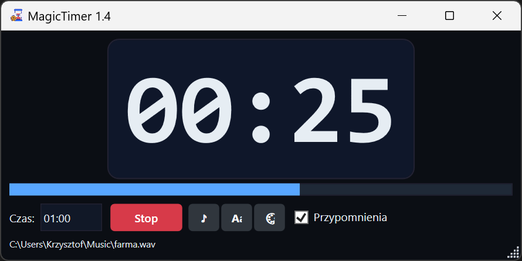
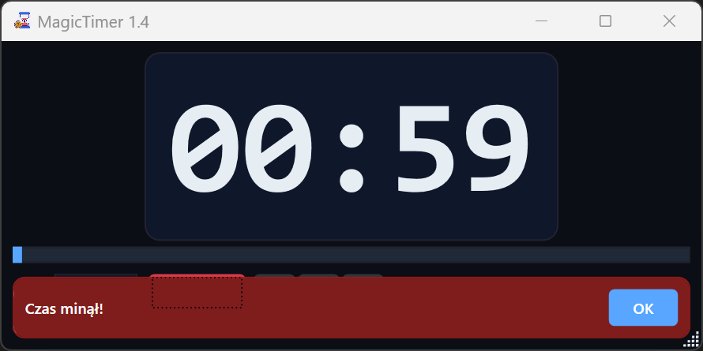
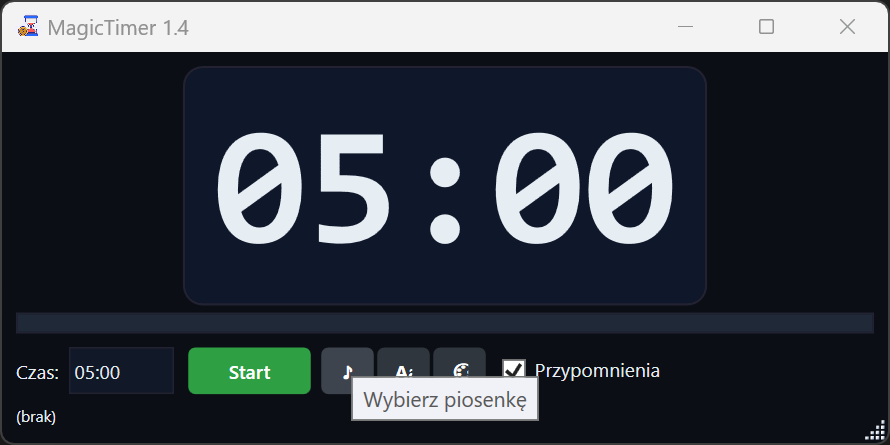
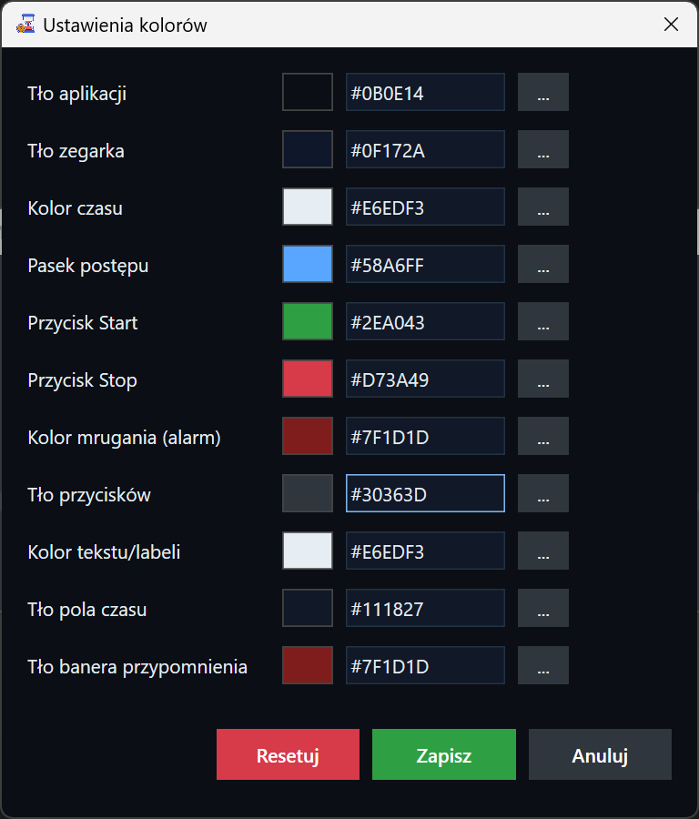
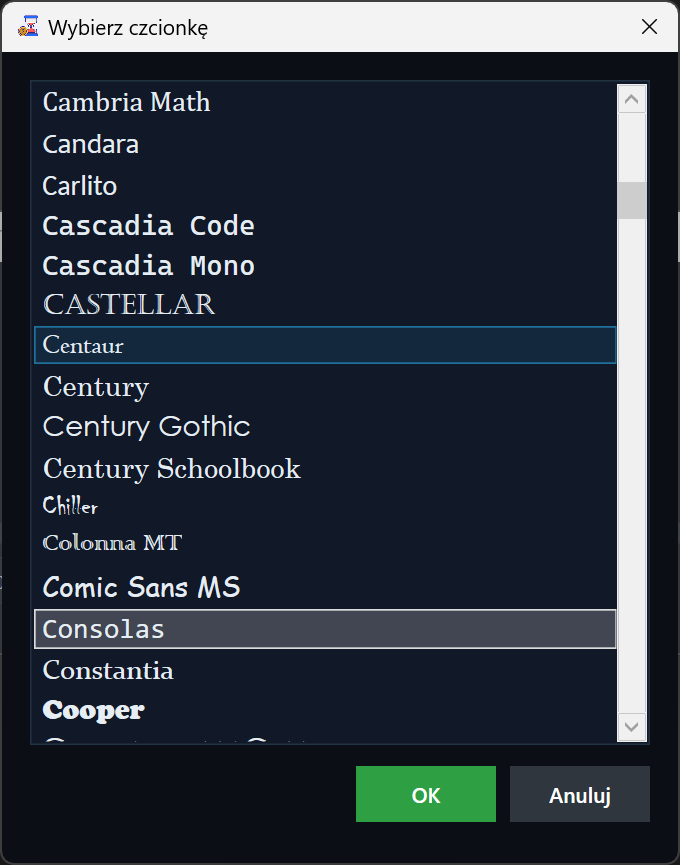
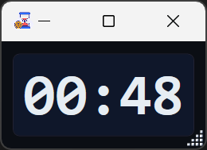

# MagicTimer

MagicTimer to lekka aplikacja typu timer/odliczanie czasu dla systemu Windows, napisana w technologii WPF (.NET).  
Pozwala w prosty sposób ustawiać odliczanie, wyświetlać czas w czytelnej formie, a po zakończeniu odliczania informuje użytkownika o upływie czasu (np. w formie przypomnienia).

Aplikacja jest dostępna jako:

- instalator **ClickOnce** – szybka instalacja i automatyczne aktualizacje,
- archiwum **ZIP** – ręczne uruchamianie bez klasycznego procesu instalacji.

Pliki instalacyjne znajdziesz w sekcji **Releases** tego repozytorium.

---

## Zrzuty ekranu

Główne okno aplikacji:


Okno odliczania:



Przypomnienie po zakończeniu odliczania:



Wybór dźwięku powiadomienia:



Wybór kolorów interfejsu:



Wybór czcionek:



Miniaturowe okno timera:



---

## Funkcje

- Ustawianie odliczania czasu (minuty, sekundy – w zależności od konfiguracji).
- Czytelne wyświetlanie aktualnego czasu do końca.
- **Przypomnienie** po zakończeniu odliczania (okno dialogowe, dźwięk – zgodnie z konfiguracją).
- Możliwość wyboru:
  - kolorystyki interfejsu (okno wyboru kolorów),
  - czcionek używanych w aplikacji.
- Tryb **mini** – niewielkie okno z podstawowymi informacjami.
- Zapisywanie ustawień w pliku konfiguracyjnym (`appsettings.json`).

---

## Wymagania

- System operacyjny: **Windows** (zalecane Windows 10 lub nowszy).
- Zainstalowany **.NET** zgodny z wersją wykorzystywaną przez projekt (typowo .NET Framework / .NET Desktop – zgodnie z konfiguracją w `MagicTimer.csproj`).
- Dostęp do internetu (w przypadku instalatora ClickOnce – na czas instalacji/aktualizacji).

---

## Instalacja

### 1. Instalator ClickOnce (zalecane dla większości użytkowników)

1. Przejdź do zakładki **[Releases](../../releases)** tego repozytorium.
2. Pobierz instalator **ClickOnce** (plik `.application` lub inny wskazany jako ClickOnce).
3. Uruchom pobrany plik – system wyświetli kreator instalacji.
4. Zaakceptuj instalację.  
   Aplikacja zostanie zainstalowana w profilu użytkownika i będzie dostępna z menu Start.
5. Przy kolejnych uruchomieniach ClickOnce automatycznie sprawdzi dostępność aktualizacji.

### 2. Archiwum ZIP

1. Przejdź do zakładki **[Releases](../../releases)**.
2. Pobierz archiwum **ZIP** z binariami MagicTimer.
3. Rozpakuj zawartość ZIP do dowolnego folderu (np. `C:\Program Files\MagicTimer` lub inny katalog użytkownika).
4. Uruchom plik wykonywalny (np. `MagicTimer.exe`).

> Uwaga: w trybie ZIP aktualizacje wykonujesz ręcznie – pobierając nową wersję z Releases i podmieniając pliki.

---

## Szybki start

1. Uruchom MagicTimer (z menu Start lub bezpośrednio z folderu, jeśli korzystasz z ZIP).
2. W głównym oknie:
   - ustaw czas odliczania,
   - opcjonalnie ustaw tekst przypomnienia.
3. Kliknij przycisk **Start** odliczania.
4. Obserwuj upływający czas:
   - w głównym oknie,
   - lub w trybie mini (jeśli go włączysz).
5. Po zakończeniu odliczania pojawi się przypomnienie (okno + dźwięk – zgodnie z konfiguracją).

---

## Personalizacja

### Kolory

1. Otwórz okno ustawień lub dedykowany przycisk zmiany kolorów.
2. Wybierz kolor tła, tekstu lub innych elementów interfejsu.
3. Zatwierdź wybór – zmiany zostaną zapisane i wykorzystane przy kolejnych uruchomieniach.

### Czcionki

1. Otwórz okno wyboru czcionki.
2. Wybierz rodzinę czcionki, rozmiar, styl (pogrubienie, kursywa – jeśli dostępne).
3. Zatwierdź – wybrane ustawienia zostaną zastosowane w wyświetlaniu czasu/napisów.

---

## Konfiguracja zaawansowana

Aplikacja korzysta z pliku konfiguracyjnego:

- `MagicTimer/appsettings.json`

W tym pliku można przechowywać np.:

- domyślne ustawienia wyglądu,
- domyślne parametry odliczania,
- inne opcje specyficzne dla aplikacji.

Zmiana tego pliku jest zalecana użytkownikom zaawansowanym/deweloperom.  
Po edycji pliku należy ponownie uruchomić aplikację.

---

## Budowanie ze źródeł

Dla deweloperów:

1. Sklonuj repozytorium:

   ```bash
   git clone https://github.com/krzysztofautomatyk/MagicTimer.git
   cd MagicTimer
   ```

2. Otwórz rozwiązanie `MagicTimer.slnx` w Visual Studio (lub innym kompatybilnym IDE).
3. Przywróć pakiety NuGet (jeśli to wymagane).
4. Zbuduj projekt `MagicTimer` w wariancie **Release**.
5. Uruchom aplikację bezpośrednio z IDE lub z katalogu `bin/Release`.

---

## Zgłaszanie błędów i propozycji

Jeżeli zauważysz:

- błąd w działaniu aplikacji,
- problem z instalacją (ClickOnce lub ZIP),
- masz propozycję nowej funkcji lub usprawnienia,

utwórz zgłoszenie w zakładce **[Issues](../../issues)** w tym repozytorium, opisując:

- wersję systemu Windows,
- sposób instalacji (ClickOnce / ZIP),
- kroki prowadzące do błędu,
- oczekiwane zachowanie.

---

## Licencja

Informacje o licencji znajdziesz w tym repozytorium (plik `LICENSE`, jeśli jest dostępny) lub w ustawieniach/projekcie.  
W razie wątpliwości co do możliwości wykorzystania aplikacji w konkretnym scenariuszu – skontaktuj się z autorem repozytorium.

---

## Autor

Repozytorium: [MagicTimer](https://github.com/krzysztofautomatyk/MagicTimer)  
Autor: [@krzysztofautomatyk](https://github.com/krzysztofautomatyk)

Jeśli aplikacja jest dla Ciebie użyteczna – możesz dodać jej **gwiazdkę (⭐ Star)** na GitHub, aby łatwiej do niej wrócić i wesprzeć jej dalszy rozwój.
